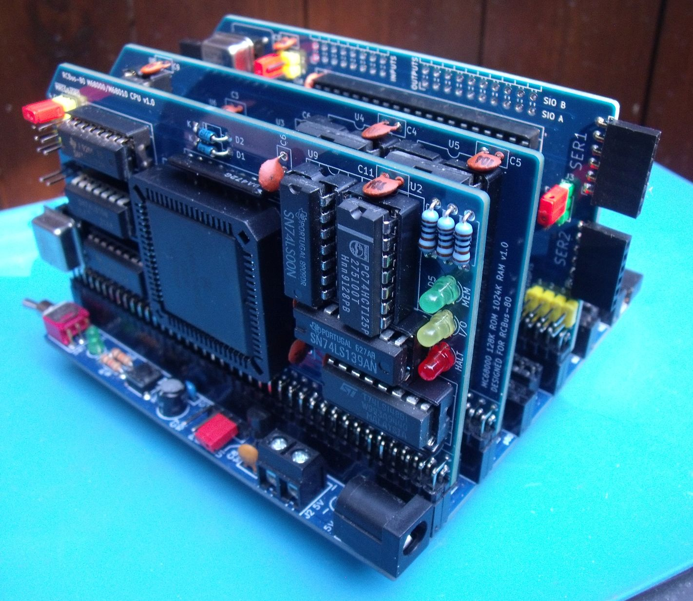

# RCBUS 68000 Board
This is my 68000 design for the RCBus. My design uses a 68000 microprocessor - not a 68008 - and is currently being tested on Steve Cousins [SC701](https://smallcomputercentral.com/rcbus/sc700-series/sc701-rcbus-backplane/) 6-slot RCBus backplane.

Release 1.0 was my proof of concept that relied on an additional connector between the CPU and ROM/RAM boards as well as partial use of the second row of bus pins.

This is now a work in progress building up to release 2.0 which has removed the additional connector between the CPU and ROM/RAM boards and relies entirely on the RCBus-80 pin connector for inter-board communication.

There are no programable logic devices (PALs, GALs, CPLDs etc) in my design. The only programmable devices are the 2 EEPROMs containing the monitor, CP/M-68K and EhBASIC.

## RCBus Signals
The RCBus specification doesn't specifically mention the 68000 in the backplane signal assignments table so there's a bit of wiggle room on the pins used.

I've stuck to the same signals for pins 1-40. The M1 signal isn't used and should have a 4K7 pullup resistor (manually added as I forgot it in my release 2.0 board!) and the USER1..USER4 which are used for the level 1, 3, 5 & 6 autovector interrupts.

Pins 41-80 carry D8..D15 as well as the higher address bits. Pins 41..44 have been used to carry some 68000 specific signals.

The current signal list is in the RCBus-68000_Pinout PDF file.

## Zilog compatability
There is no intention to support any Zilog specific chips such as the PIO, SIO, CTC or KIO as their signals and timing are just too different. The PIO and SIO have equivalents in the 68230 and 68681 chips. The KIO has a sort-of equivalent in the 68901. A  CTC type chip may not be needed as the 68230 and 68681 have their own timers and the 68901 has 4 simple timers.

## 68000 memory space
The ROM/RAM board decodes memory into 1Mb blocks and is hard configured such that the ROM starts at address $000000 and the RAM starts at address $100000.

The serial board is populated with two 68681 (or equivalent) DUARTS giving 4 UARTs in total. Each DUART can reside at one of 8 selectable 2K memory addresses from $D00000 to $D03FFF.

The parallel I/O board is populated with two 68230 (or equivalent) PI/T (Parallel Interface/Timers). Each PI/T can reside at one of 8 selectable 2K memory addresses from $D08000 to $D0BFFF.
 
The multifunction peripheral board is populated with two 68901 (or equivalent). Each MFP can reside at one of 8 selectable 2K memory addresses from $D10000 to $D13FFF.

## RCBus memory space
My 68000 design partially decodes 2 blocks of memory within the 68000 address range as follows:
| Address Range | Signal |
| :---- | :---- |
| 0xF00000..0xF7FFFF | /MREQ goes low |
| 0xF80000..0xFFFFFF | /IORQ goes low |

This partial decoding results in the RCBus I/O and memory spaces appearing multiple times within the 68000 address range. A /DTACK signal is generated on the processor card for any access to the RCBus whether there is a device present at that address or not.

For both I/O and memory spaces, consecutive memory locations are accessed on the ODD bytes such that I/O address 0x00 is accessed at address 0xF80001, address 0x01 is accessed at address 0xF80003 etc.

## What works so far
Currently the following boards are assembled and are working as intended:
* 68000 procesor board
* ROM / RAM board - 128K ROM & 1M RAM
* Quad serial I/O board - with 2 68681 DUARTs

## To do
These boards are waiting to be populated and tested:
* Digital I/O board - with 2 68230 PI/Ts
* Mutifunction board - with 2 68901 MFPs
 
## Progress
Currently the 68000 board, the ROM/RAM board and the serial I/O board are working and a small monitor program is running that allows me to download Motorola S-records. Both S2 & S3 record types are handled.

The monitor currently supports a few of the EASy68K TRAP #15 text I/O functions - currently just tasks 0, 1, 5, 6, 13 & 14 - which are all related to text input/output. Further tasks may be added as I need them.

I have a number of Steve Cousin's RC2014 / RCBus boards that I have been able to use successfully in the 68000 system. The code folder holds some example code for these boards as well as CP/M-68K v1.3 using the CompactFlash boards.
| Name | Description |
| :---- | :---- |
| [SC129](https://smallcomputercentral.com/rcbus/sc100-series/sc129-digital-i-o-rc2014/) | digital I/O module |
| [SC145](https://smallcomputercentral.com/rcbus/sc100-series/sc145-compact-flash-rc2014/) | CompactFlash module |
| [SC611](https://smallcomputercentral.com/rcbus/sc600-series/sc611-rcbus-micro-sd/) | MicroSD module |
| [SC704](https://smallcomputercentral.com/rcbus/sc700-series/sc704-rcbus-i2c-bus-master/) | I2C bus master module |
| [SC406](https://smallcomputercentral.com/i2c-bus-modules/sc406-i2c-temperature-sensor-module/) | I2C temperature sensor module |
| [SC705](https://smallcomputercentral.com/rcbus/sc700-series/sc705-rcbus-serial-acia/) | serial ACIA module |
| [SC729](https://smallcomputercentral.com/rcbus/sc700-series/sc729-rcbus-compact-flash-module/) | CompactFlash module |

The SC145 & SC729 CompactFlash modules have both been tested with CP/M-68K v1.3 and appear to operate correctly.

# Still to do
* Build and test the 68230 digital I/O board
* Build and test the 68901 MFP board

# Conclusion
The previous version 1 suite of boards have proven that it is possible to run a 68000 based processor system on a standard RCBus backplane that is also compatible with a selection of RCBus / RC2014 boards. The new version 2 suite of boards should present a bit more of a polished solution to my RCBus 68000 design.

# Latest News
I've recently purchased an [RCBus video card](https://peacockmedia.software/RC2014/TMSEMU/) from Sheila Dixon to experiment with. Hopefully there will be good news to report in the near future on this board.

I've also started making headway with generating some programs written in C using GCC and I hope to share progress on that shortly.